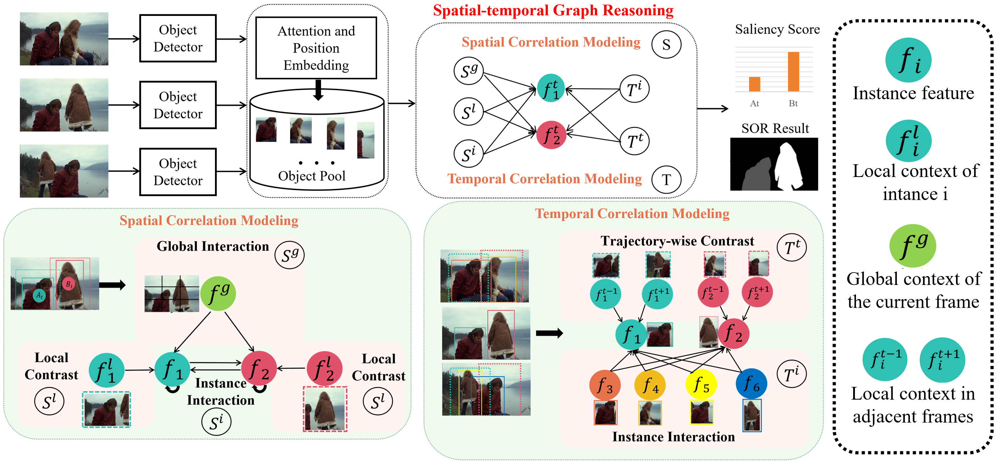

<h1>VSOR (NeurIPS2024)</h1>
<h3>A Motion-aware Spatio-temporal Graph for Video Salient Object Ranking</h3>

# Abstract
Video salient object ranking aims to simulate the human attention mechanism by dynamically prioritizing the visual attraction of objects in a scene over time. Despite its numerous practical applications, this area remains underexplored. In this work, we propose a graph model for video salient object ranking. This graph simultaneously explores multi-scale spatial contrasts and intra-/inter-instance temporal correlations across frames to extract diverse spatio-temporal saliency cues. It has two advantages: 1. Unlike previous methods that only perform global inter-frame contrast or compare all proposals across frames globally, we explicitly model the motion of each instance by comparing its features with those in the same spatial region in adjacent frames, thus obtaining more accurate motion saliency cues. 2. We synchronize the spatio-temporal saliency cues in a single graph for joint optimization, which exhibits better dynamics compared to the previous stage-wise methods that prioritize spatial cues followed by temporal cues. Additionally, we propose a simple yet effective video retargeting method based on video saliency ranking. Extensive experiments demonstrate the superiority of our model in video salient object ranking and the effectiveness of the video retargeting method. Code will be publicly available.

# Method

  

# Datasets
RVSOD[link](https://github.com/Pchank/Ranking-Video-Salient-Object-Detection)
DAVSOD[link](https://github.com/DengPingFan/DAVSOD)
